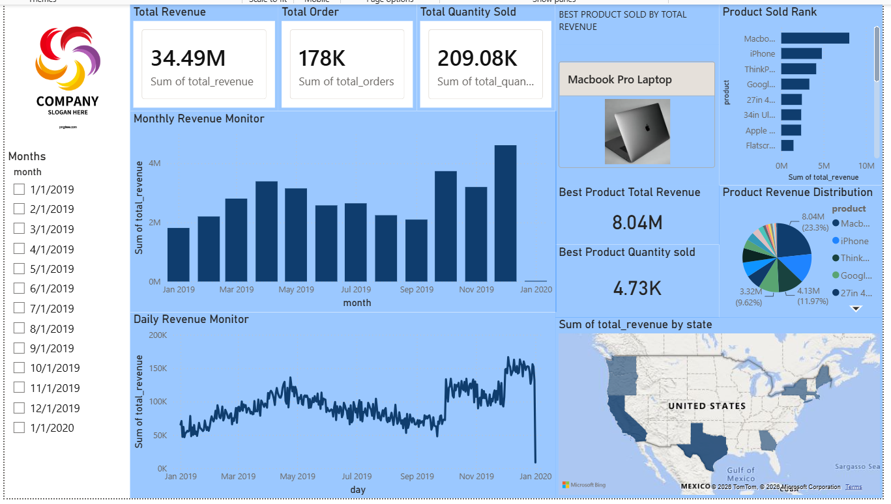

# End-to-End Data Sales 2019

**Real-time sales analytics pipeline** — Neon (PostgreSQL) → Streamkap (CDC) → MotherDuck (DuckDB) → Power BI.



---

## Architecture

```
+----------------+     +----------------+     +----------------+     +----------------+
|    Neon        | --> |  Streamkap     | --> |  MotherDuck    | --> |   Power BI     |
|   (OLTP DB)    | CDC | (CDC Engine)   | JDBC| (OLAP Cloud)   |  PG |(Visualization) |
|   sales table  |     | source+dest    |     | sales_*_view   |  EP |  dashboards    |
+----------------+     +----------------+     +----------------+     +----------------+
```

## Dataset

**186,000 rows** of 2019 electronics store sales (Kaggle). Covers 19 products across the US with columns:
`order_id`, `product`, `quantity_ordered`, `price_each`, `order_date`, `purchase_address`.

## Tech Stack

| Layer | Technology | Role |
|-------|-----------|------|
| Source DB | [Neon](https://neon.tech) | Serverless PostgreSQL (OLTP) |
| CDC Engine | [Streamkap](https://streamkap.com) | Change Data Capture via logical replication |
| Analytics DB | [MotherDuck](https://motherduck.com) | Cloud DuckDB (OLAP) |
| BI Tool | [Power BI](https://powerbi.microsoft.com) | Dashboards & visualization |

## Quick Start

### 1. Neon — Source Database

```bash
psql $NEON_DATABASE_URL -f neon/schema.sql
psql $NEON_DATABASE_URL -f neon/seed.sql
psql $NEON_DATABASE_URL -f neon/replication-setup.sql
```

This creates the `sales` table, loads the CSV, and sets up a publication for CDC.

### 2. Streamkap — CDC Pipeline

1. Create a **Neon source connector** → `streamkap/source-neon.json` (use **unpooled** hostname)
2. Create a **MotherDuck destination connector** → `streamkap/destination-motherduck.json`
3. Link them in a pipeline in the Streamkap UI — streaming starts immediately

### 3. MotherDuck — Analytics Views

Run in MotherDuck SQL editor:

```sql
-- setup.sql   → creates database + schemas
-- analytics-views.sql → creates v_monthly_sales, v_top_products, v_daily_sales, v_sales_by_city
```

### 4. Power BI — Dashboard

Follow [`powerbi/README.md`](powerbi/README.md) to connect via MotherDuck's PostgreSQL endpoint (no ODBC drivers needed).

## Dashboard Preview

| Tab | Visuals |
|-----|---------|
| Monthly Overview | Line chart (revenue), card (total), table (breakdown) |
| Product Performance | Bar chart (top products), scatter (qty vs price) |
| Geographic | Map chart (sales by city/state) |
| Daily Trends | Area chart (revenue), date range slicer |

## Important Notes

- **Neon → Streamkap**: Use the **unpooled** Neon hostname (remove `-pooler`). PgBouncer does not support PostgreSQL replication protocol.
- **MotherDuck → Power BI**: Use the **PostgreSQL endpoint** — no ODBC drivers needed.
- **Power BI mode**: **DirectQuery** for live data; **Import** for faster performance with scheduled refresh.
- **Logical Replication**: Must be enabled in Neon Project Settings.

## Project Structure

```
.
+-- neon/
|   +-- data/all_data.csv              # Source dataset (186K rows)
|   +-- schema.sql                     # OLTP table definition
|   +-- seed.sql                       # CSV import script
|   +-- replication-setup.sql          # CDC publication + replication user
+-- streamkap/
|   +-- source-neon.json               # Streamkap Neon source connector
|   +-- destination-motherduck.json    # Streamkap MotherDuck destination
+-- motherduck/
|   +-- setup.sql                      # Database/schema creation
|   +-- analytics-views.sql            # Power BI-friendly views
+-- powerbi/
|   +-- README.md                      # Connection guide for Power BI
|   +-- powerbidashboardsales2019.png   # Dashboard screenshot
+-- .env.example                       # Credential template
+-- README.md                          # This file
```
